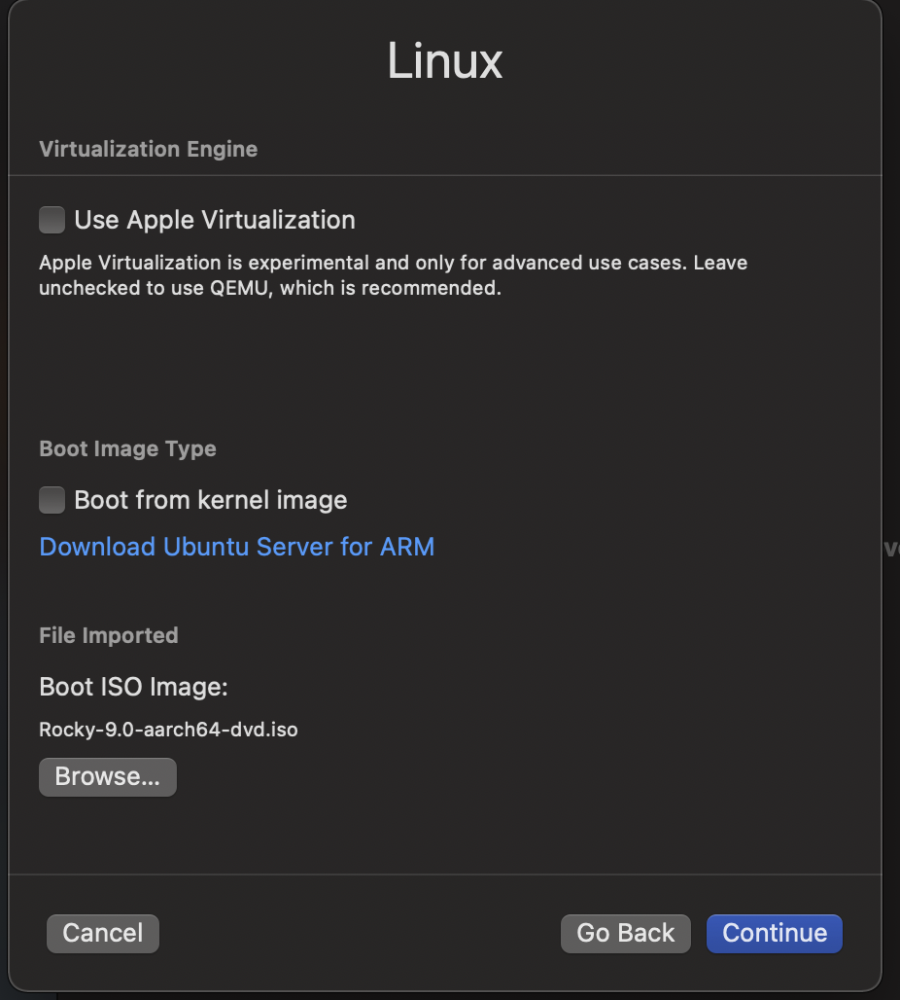
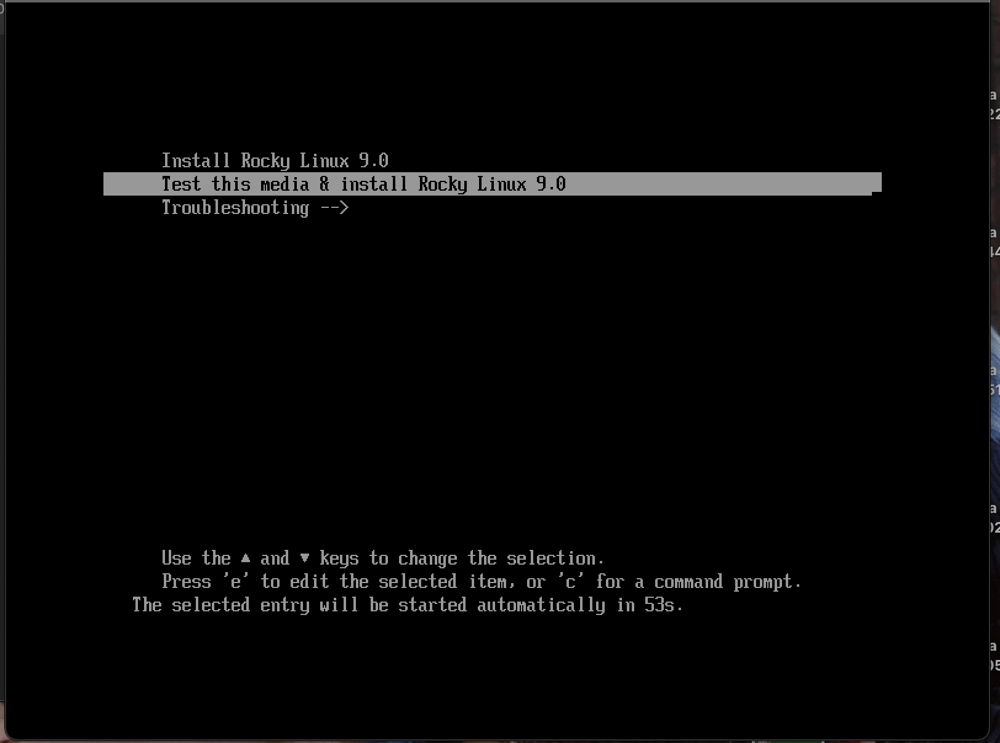
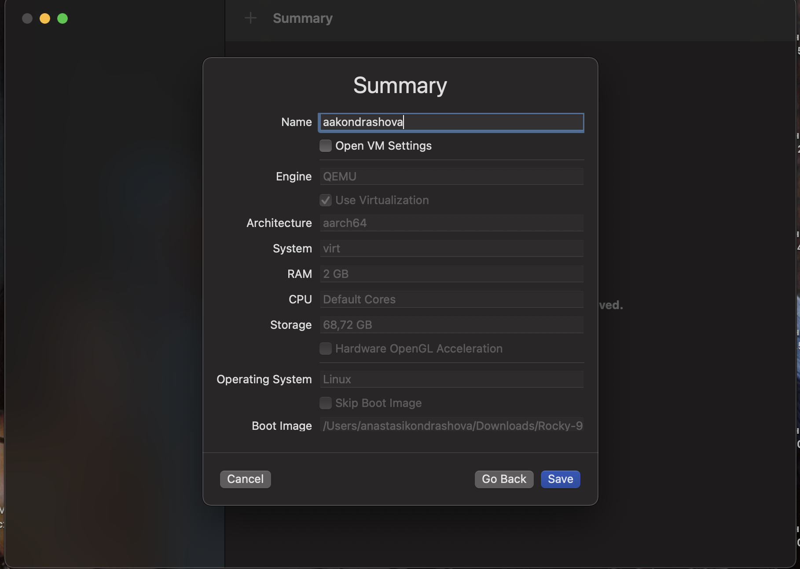
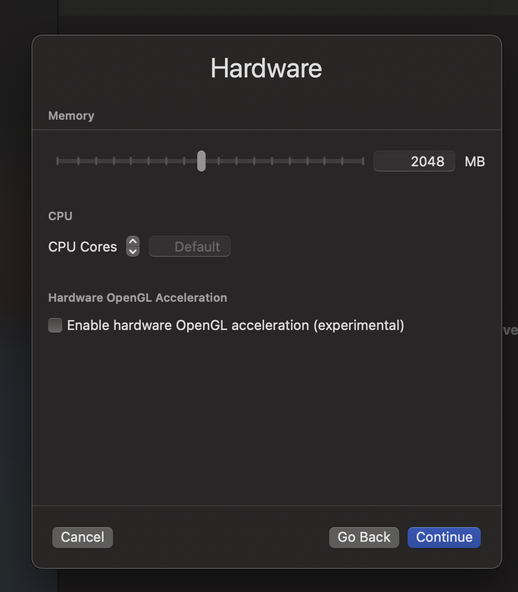
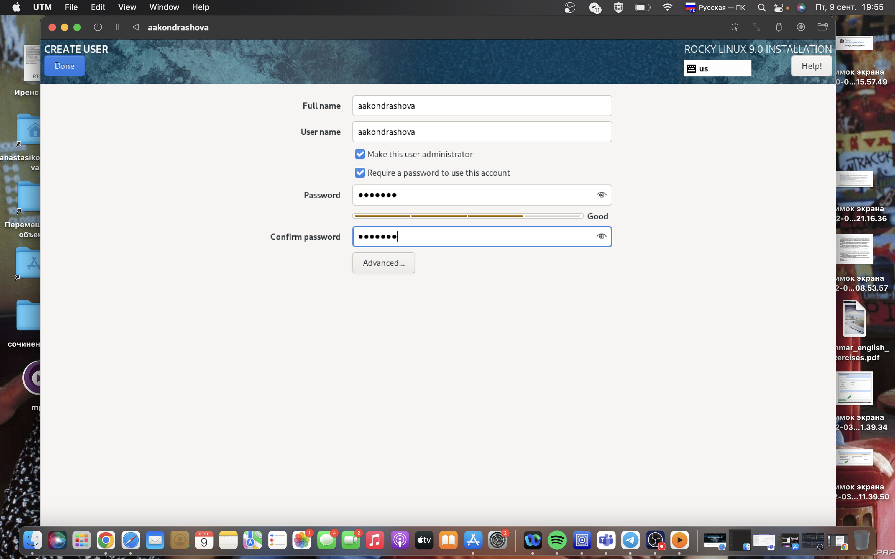
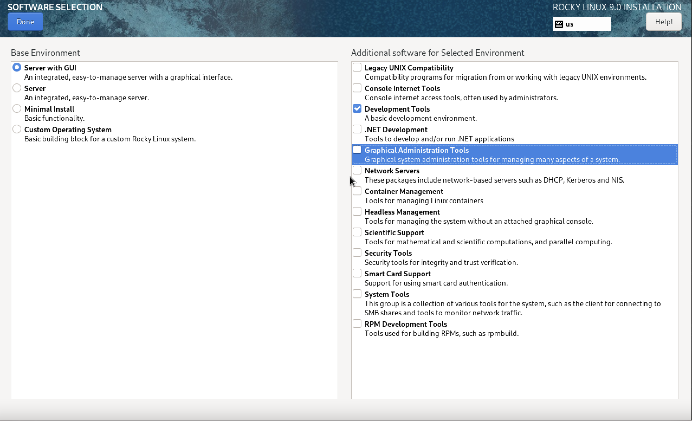
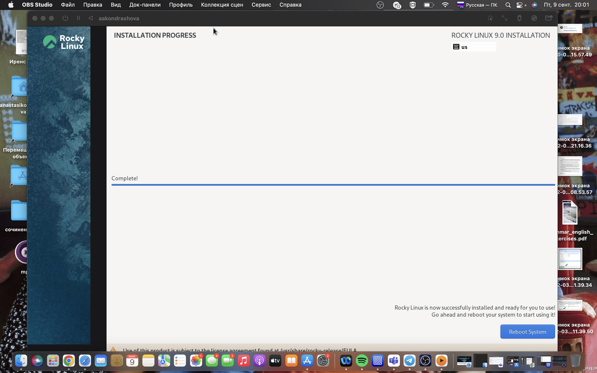

---
## Front matter
title: "Лабораторная работа №1"
subtitle: "Информационная безопасность"
author: "Анастасия Андреевна Кондрашова"

## Generic otions
lang: ru-RU
toc-title: "Содержание"

## Bibliography
bibliography: bib/cite.bib
csl: pandoc/csl/gost-r-7-0-5-2008-numeric.csl

## Pdf output format
toc: true # Table of contents
toc-depth: 2
lof: true # List of figures
lot: true # List of tables
fontsize: 12pt
linestretch: 1.5
papersize: a4
documentclass: scrreprt
## I18n polyglossia
polyglossia-lang:
  name: russian
  options:
	- spelling=modern
	- babelshorthands=true
polyglossia-otherlangs:
  name: english
## I18n babel
babel-lang: russian
babel-otherlangs: english
## Fonts
mainfont: PT Serif
romanfont: PT Serif
sansfont: PT Sans
monofont: PT Mono
mainfontoptions: Ligatures=TeX
romanfontoptions: Ligatures=TeX
sansfontoptions: Ligatures=TeX,Scale=MatchLowercase
monofontoptions: Scale=MatchLowercase,Scale=0.9
## Biblatex
biblatex: true
biblio-style: "gost-numeric"
biblatexoptions:
  - parentracker=true
  - backend=biber
  - hyperref=auto
  - language=auto
  - autolang=other*
  - citestyle=gost-numeric
## Pandoc-crossref LaTeX customization
figureTitle: "Рис."
tableTitle: "Таблица"
listingTitle: "Листинг"
lofTitle: "Список иллюстраций"
lotTitle: "Список таблиц"
lolTitle: "Листинги"
## Misc options
indent: true
header-includes:
  - \usepackage{indentfirst}
  - \usepackage{float} # keep figures where there are in the text
  - \floatplacement{figure}{H} # keep figures where there are in the text
---

# Цель работы

1. Приобретение практических навыков установки ОС на виртуальную машину.
2. Настройка минимально необходимых для дальнейшей работы сервисов.

# Выполнение лабораторной работы

1. Так как на моем ПК не было возможности установить VirtualBox я установила UTM, на ней я развернула операционную систему Linux (дистрибутив: Rocky 9)

{ #fig:001 width=70% }

{ #fig:002 width=70% }

2. Указываем некоторые настройки для нашей виртуальной машины, называем ее 'aakondrashova'

{ #fig:003 width=70% }

3. Указываем необходимый объем памяти(2048 гб)

{ #fig:004 width=70% }

4. Выполняем все необходимые настройки (согласно инструкции), а также создаем пользователя с правами администратора и задаем пароль

{ #fig:005 width=70% }

{ #fig:006 width=70% }

5. После установки перезагружаем систему. В итоге получаем готовую к использованию систему linux с готовым интерфейсом, что позволяет использовать ее как полноценную ОС.

{ #fig:007 width=70% }

# Выводы

1. Я приобрела практические навыки установки операционной системы Linus на операционную систему MacOS
2. Настроила виртуальную машину для дальнейшей работы

# Контрольные вопросы

1. Учетная запись пользователя содержит: имя пользователя (логин) и пароль.
2. Команда для получения справки по команде - man ваша_команда Команда для перемещения по файловой системе – cd Команда для просмотра содержимого каталога - ls Команда для определения объёма папки – du имя_папки Команда для создания каталога – mkdir Команда для создания файла – touch Команда для удаления каталогов - rm Команда для удаления файлов - rm -f Команда для задания определённых прав - chmod права_доступа имя_файла_или_имя_директории, где вместо «прав доступа» пишутся специальные знаки, обозначающие эти права доступа (u, g, o, a; +, -, =; r, w, x) Команда для просмотра истории команд – history
3. Файловая система – это набор правил, устанавливающий способ хранения данных на определенном носителе информации. Ext2, Ext3, Ext4 или Extended Filesystem - это стандартная файловая система для Linux, самая стабильная, содержит больше всего функций. JFS или Journaled File System была разработана в IBM для AIX UNIX и использовалась в качестве альтернативы для файловых систем ext.Сейчас она используется там, где необходима высокая стабильность и минимальное потребление ресурсов. ReiserFS - была разработана намного позже, в качестве альтернативы ext3 с улучшенной производительностью и расширенными возможностями. XFS - это высокопроизводительная файловая система, разработанная в Silicon Graphics для собственной операционной системы, для больших файлов и поддерживала диски до 2 терабайт. Btrfs или B-Tree File System - это совершенно новая файловая система, которая сосредоточена на отказоустойчивости, легкости администрирования и восстановления данных. Другие файловые системы, такие как NTFS, FAT, HFS могут использоваться в Linux, но корневая файловая система linux на них не устанавливается, поскольку они для этого не предназначены.
4. Чтобы посмотреть, какие файловые системы продемонстрированы в ОС, используется команда findmtn –all.
5. Команды kill, xkill, pkill, killall cлужат для завершения процессов. Но они принимают различные параметры для идентификации процессов. Kill нужен PID процесса, xkill - достаточно кликнуть по окну, чтобы закрыть его, killall и pkill принимают имя процесса.
