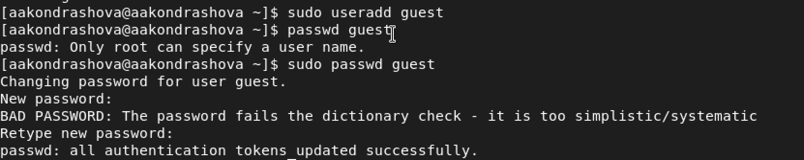
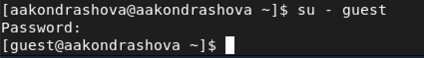
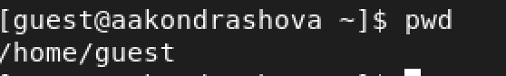
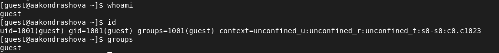
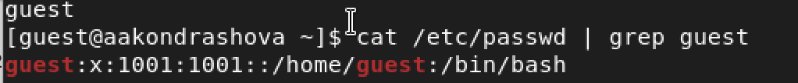
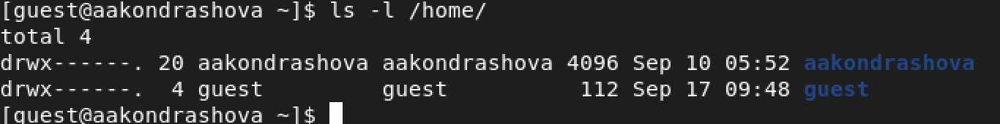
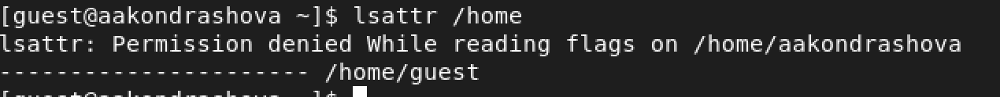
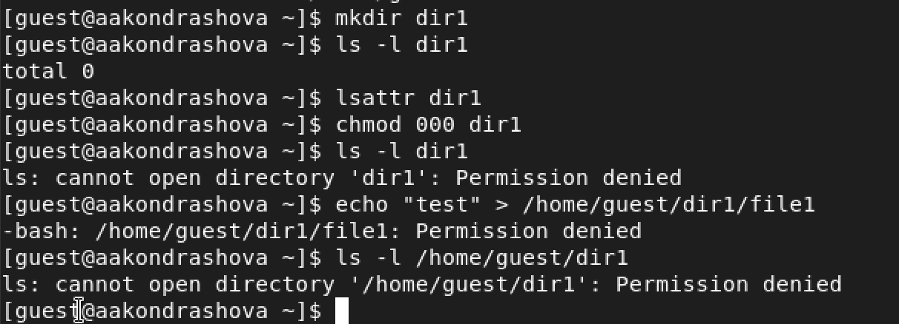
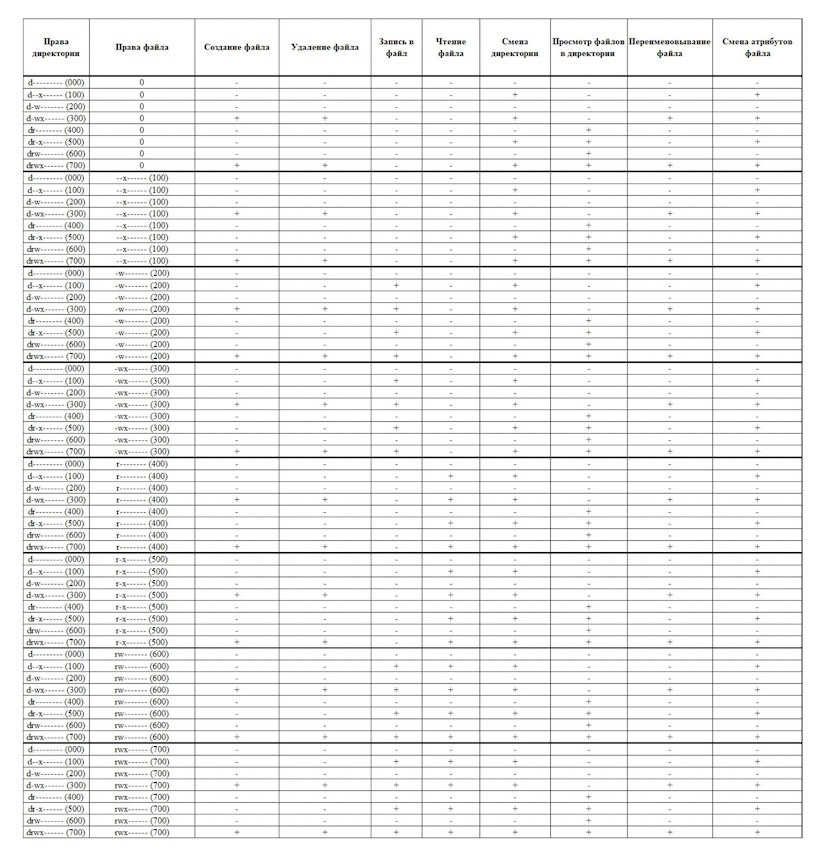

---
## Front matter
lang: ru-RU
title: Лабораторная работа №2
subtitle: Основы информационной безопасности
author:
  - Кондрашова А. А.
institute:
  - Российский университет дружбы народов, Москва, Россия
  - НПМбд-01-19
date: 17 сентября 2022

## i18n babel
babel-lang: russian
babel-otherlangs: english

## Formatting pdf
toc: false
toc-title: Содержание
slide_level: 2
aspectratio: 169
section-titles: true
theme: metropolis
header-includes:
 - \metroset{progressbar=frametitle,sectionpage=progressbar,numbering=fraction}
 - '\makeatletter'
 - '\beamer@ignorenonframefalse'
 - '\makeatother'
---

# Дискреционное разграничение прав в Linux. Основные атрибуты

## Цели и задачи

- Получение практических навыков работы в консоли с атрибутами файлов
- Закрепление теоретических основ дискреционного доступа в современных системах на базе ОС Linux

## Выполнение работы

В установленной ОС создаем учетную запись для нового пользователя, используя учетную запись администратора, а затем задаем пароль для этого пользователя.

{ #fig:001 width=70% }

## Выполнение работы

Входим в системы под именем нового пользователя.

{ #fig:002 width=70% }

## Выполнение работы

Определяем директорию, в которой мы находимся.Она является домашней директорией (имя равно имени в домашней строке), поэтому менять директорию нам не требуется.

{ #fig:003 width=70% }

## Выполнение работы

Уточняем имя пользователя, командой id уточняем более подробную информацию (имя пользователя, его группу, а также группы, куда он входит). Затем сравниваем вывод команды id и groups.

{ #fig:004 width=70% }

## Выполнение работы

Смотрим файл /etc/passwd, для того, чтобы видеть только информацию, требующуюся мне в данный момент воспользуемя командой cat /etc/passwd | grep guest. Это нужно нам, чтобы сравнить эту информацию с выведенной в предыдущем пункте.

{ #fig:005 width=70% }

## Выполнение работы

Определяем существующие директории, нам удалось получить к ним доступ, а также посмотреть, какие права установлены на них.

{ #fig:006 width=70% }

## Выполнение работы

Пытаемся посмотреть, какие расширения установленны на поддиректориях домашней папки, но нам это не удается.

{ #fig:007 width=70% }

## Выполнение работы

- Создаем поддиректорию
- Определяем, какие права доступа и расширенный атрибуты выставлены для нее
- Снимаем все атрибуты
- Пытаемся создать файл, но он не создается, т.к у нас недостаточно прав на это

{ #fig:008 width=70% }

## Выполнение работы

Заполняем таблицу "Установленные права и разрешенные действия"

{ #fig:009 width=40% }

## Выполнение работы

Заполняем таблицу "Минимальные права для совершения операций"

{ #fig:010 width=70% }

## Вывод

- Получены навыки работы в консоли с атрибутами файлов и получены теоретические знания о них.

