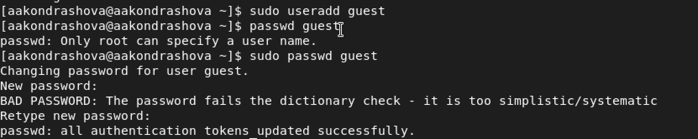
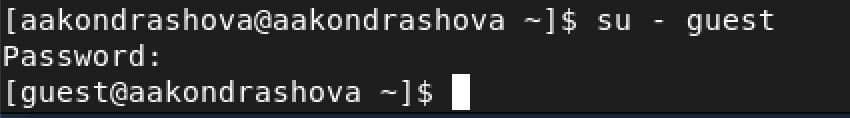
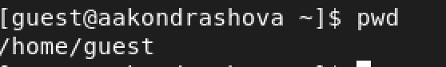
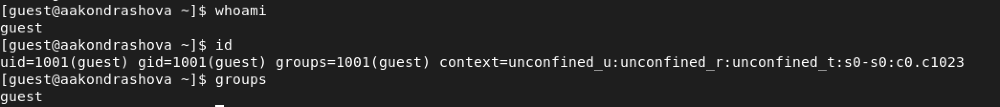
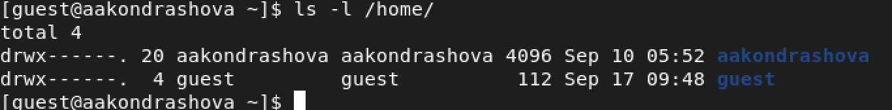
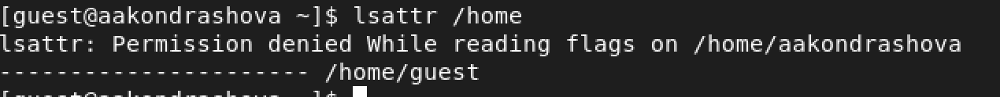
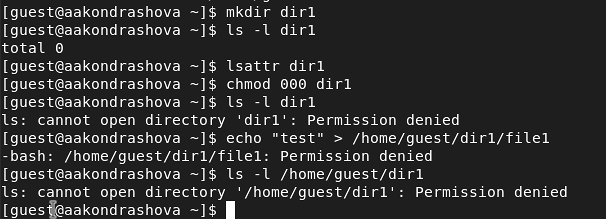
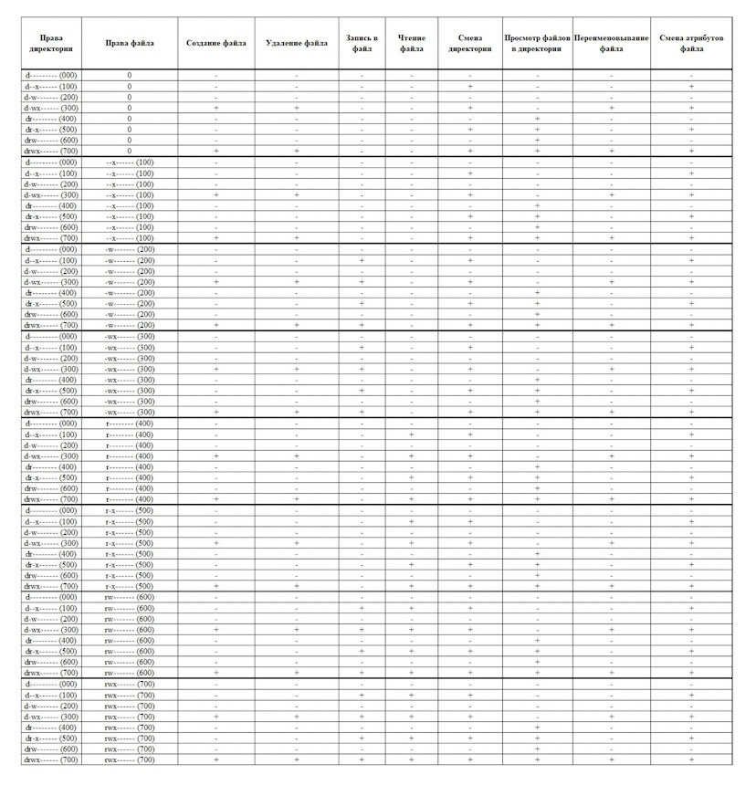
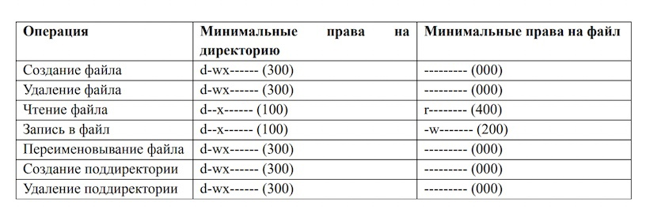

---
## Front matter
title: "Лабораторная работа №2"
subtitle: "Основы информационной безопасности"
author: "Анастасия Андреевна Кондрашова"

## Generic otions
lang: ru-RU
toc-title: "Содержание"

## Bibliography
bibliography: bib/cite.bib
csl: pandoc/csl/gost-r-7-0-5-2008-numeric.csl

## Pdf output format
toc: true # Table of contents
toc-depth: 2
lof: true # List of figures
lot: true # List of tables
fontsize: 12pt
linestretch: 1.5
papersize: a4
documentclass: scrreprt
## I18n polyglossia
polyglossia-lang:
  name: russian
  options:
	- spelling=modern
	- babelshorthands=true
polyglossia-otherlangs:
  name: english
## I18n babel
babel-lang: russian
babel-otherlangs: english
## Fonts
mainfont: PT Serif
romanfont: PT Serif
sansfont: PT Sans
monofont: PT Mono
mainfontoptions: Ligatures=TeX
romanfontoptions: Ligatures=TeX
sansfontoptions: Ligatures=TeX,Scale=MatchLowercase
monofontoptions: Scale=MatchLowercase,Scale=0.9
## Biblatex
biblatex: true
biblio-style: "gost-numeric"
biblatexoptions:
  - parentracker=true
  - backend=biber
  - hyperref=auto
  - language=auto
  - autolang=other*
  - citestyle=gost-numeric
## Pandoc-crossref LaTeX customization
figureTitle: "Рис."
tableTitle: "Таблица"
listingTitle: "Листинг"
lofTitle: "Список иллюстраций"
lotTitle: "Список таблиц"
lolTitle: "Листинги"
## Misc options
indent: true
header-includes:
  - \usepackage{indentfirst}
  - \usepackage{float} # keep figures where there are in the text
  - \floatplacement{figure}{H} # keep figures where there are in the text
---

# Цель работы

1. Получение практических навыков работы в консоли с атрибутами файлов
2. Закрепление теоретических основ дискреционного доступа в современных системах на базе ОС Linux

# Выполнение лабораторной работы

1. В установленной ОС создаем учетную запись для нового пользователя, используя учетную запись администратора, а затем задаем пароль для этого пользователя.

{ #fig:001 width=70% }

2. Входим в системы под именем нового пользователя

{ #fig:002 width=70% }

3. Определяем директорию, в которой мы находимся.Она является домашней директорией (имя равно имени в домашней строке), поэтому менять директорию нам не требуется.

{ #fig:003 width=70% }

4. Уточняем имя пользователя, командой id уточняем более подробную информацию (имя пользователя, его группу, а также группы, куда он входит). Затем сравниваем вывод команды id и groups.

{ #fig:004 width=70% }

5. Смотрим файл /etc/passwd, для того, чтобы видеть только информацию, требующуюся мне в данный момент воспользуемя командой cat /etc/passwd | grep guest. Это нужно нам, чтобы сравнить эту информацию с выведенной в предыдущем пункте.

{ #fig:005 width=70% }

6. Определяем существующие директории, нам удалось получить к ним доступ, а также посмотреть, какие права установлены на них.

{ #fig:006 width=70% }

7. Пытаемся посмотреть, какие расширения установленны на поддиректориях домашней папки, но нам это не удается.

{ #fig:007 width=70% }

8. 
- Создаем поддиректорию
- Определяем, какие права доступа и расширенный атрибуты выставлены для нее
- Снимаем все атрибуты
- Пытаемся создать файл, но он не создается, т.к у нас недостаточно прав на это

{ #fig:008 width=70% }

9. Заполняем таблицу "Установленные права и разрешенные действия"

{ #fig:009 width=70% }

10. Заполняем таблицу "Минимальные права для совершения операций"

{ #fig:010 width=70% }

# Выводы

Получены навыки работы в консоли с атрибутами файлов и получены теоретические знания о них.

