---
## Front matter
lang: ru-RU
title: Лабораторная работа №3
subtitle: Основы информационной безопасности
author:
  - Кондрашова А. А.
institute:
  - Российский университет дружбы народов, Москва, Россия
  - НПМбд-01-19
date: 24 сентября 2022

## i18n babel
babel-lang: russian
babel-otherlangs: english

## Formatting pdf
toc: false
toc-title: Содержание
slide_level: 2
aspectratio: 169
section-titles: true
theme: metropolis
header-includes:
 - \metroset{progressbar=frametitle,sectionpage=progressbar,numbering=fraction}
 - '\makeatletter'
 - '\beamer@ignorenonframefalse'
 - '\makeatother'
---

## Цели и задачи

- Получение практических навыков работы в консоли с атрибутами файлов для групп пользователей.

## Выполнение работы

- В установленной ОС создаем пользователя guest2, т.к пользователь guest уже был создан в лабораторной работе №2

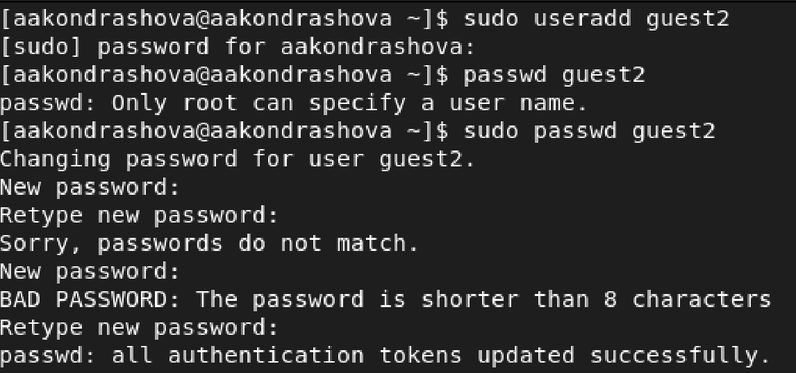{ #fig:001 width=70% }

## Выполнение работы

 - Добавим нового пользователя в группу guest

{ #fig:002 width=70% }

## Выполнение работы

- Осуществим вход в систему от двух пользователей (в разных консолях) и поссмотрим директорию, в которой находимся. Для обоих пользователей это домашняя папка.

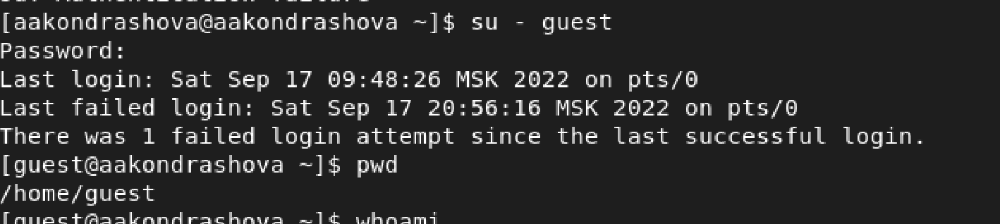{ #fig:003 width=70% }

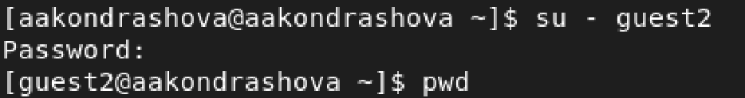{ #fig:004 width=70% }

## Выполнение работы

- Уточним для каждого пользователя информацию об имени группе, кто входит в нее и к каким группам принадлежит сам пользователь.

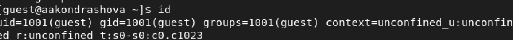{ #fig:005 width=70% }

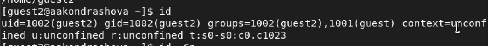{ #fig:006 width=70% }

## Выполнение работы

 - Командой groups выведем информцию о том, в какие группы входят пользователи guest и guest2. Сравнивая с выводом команды id -G и id -Gn получаем, что они обе выводят информацию, о группах, в которые входит пользователь.

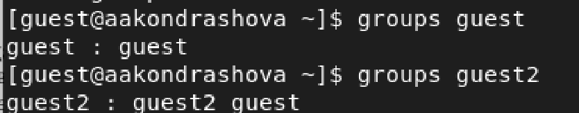{ #fig:007 width=70% }

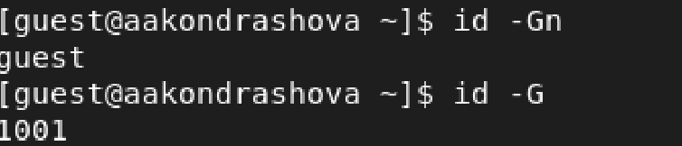{ #fig:008 width=70% }

## Выполнение работы

Также просматриваем вывод команды cat /etc/group, которая тоже выдает нам информацию о группах всех пользователей.

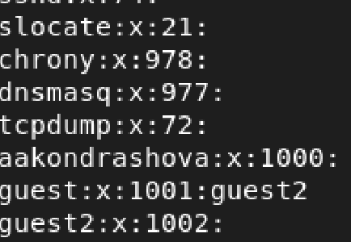{ #fig:009 width=70% }

## Выполнение работы

От имени пользователя guest2 выполним регистрацию этого пользователя в группе guest.

{ #fig:010 width=70% }

## Выполнение работы

От пользователя guest изменяем права директории и снимем все атрибуты.

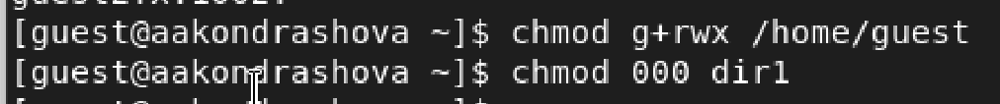{ #fig:011 width=70% }

## Выполнение работы

Заполним таблицу "Установленные права и разрешенные действия для групп"

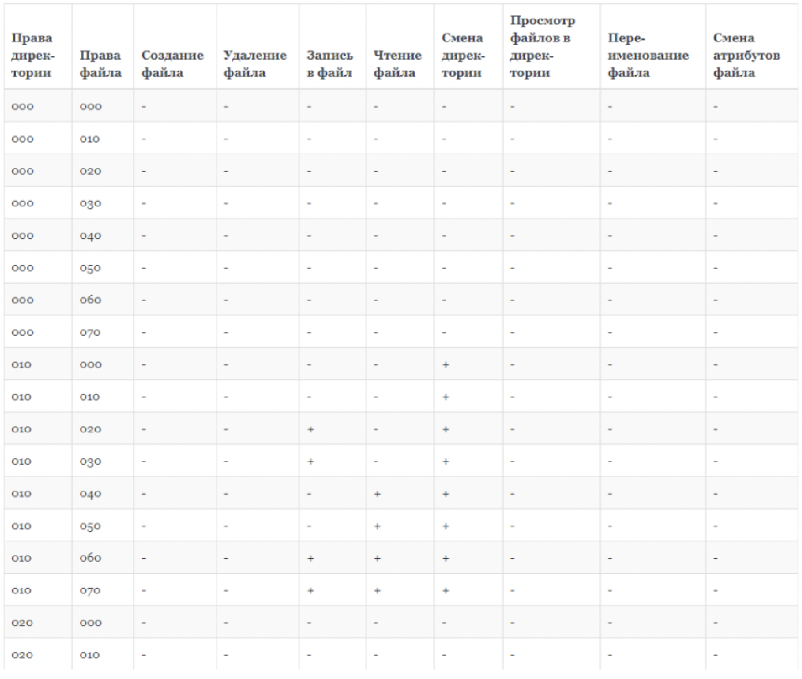{ #fig:012 width=70% }

## Выполнение работы

Заполним таблицу "Минимальные права для совершения операций от имени пользователей, входящих в группу"

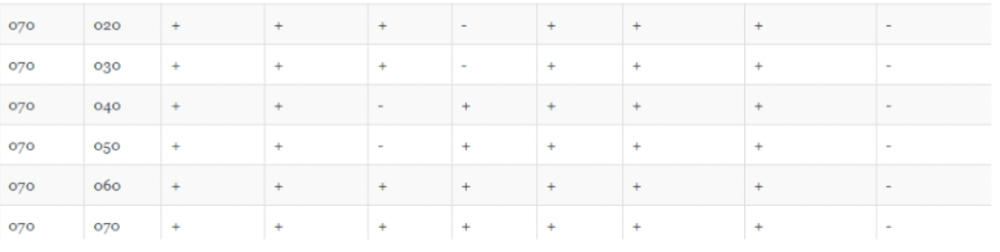{ #fig:013 width=70% }

## Вывод

- Мною получены практические навыки работы в консоли с атрибутами файлов для групп пользователей.

