---
## Front matter
title: "Лабораторная работа №3"
subtitle: "Основы информационной безопасности"
author: "Анастасия Андреевна Кондрашова"

## Generic otions
lang: ru-RU
toc-title: "Содержание"

## Bibliography
bibliography: bib/cite.bib
csl: pandoc/csl/gost-r-7-0-5-2008-numeric.csl

## Pdf output format
toc: true # Table of contents
toc-depth: 2
lof: true # List of figures
lot: true # List of tables
fontsize: 12pt
linestretch: 1.5
papersize: a4
documentclass: scrreprt
## I18n polyglossia
polyglossia-lang:
  name: russian
  options:
	- spelling=modern
	- babelshorthands=true
polyglossia-otherlangs:
  name: english
## I18n babel
babel-lang: russian
babel-otherlangs: english
## Fonts
mainfont: PT Serif
romanfont: PT Serif
sansfont: PT Sans
monofont: PT Mono
mainfontoptions: Ligatures=TeX
romanfontoptions: Ligatures=TeX
sansfontoptions: Ligatures=TeX,Scale=MatchLowercase
monofontoptions: Scale=MatchLowercase,Scale=0.9
## Biblatex
biblatex: true
biblio-style: "gost-numeric"
biblatexoptions:
  - parentracker=true
  - backend=biber
  - hyperref=auto
  - language=auto
  - autolang=other*
  - citestyle=gost-numeric
## Pandoc-crossref LaTeX customization
figureTitle: "Рис."
tableTitle: "Таблица"
listingTitle: "Листинг"
lofTitle: "Список иллюстраций"
lotTitle: "Список таблиц"
lolTitle: "Листинги"
## Misc options
indent: true
header-includes:
  - \usepackage{indentfirst}
  - \usepackage{float} # keep figures where there are in the text
  - \floatplacement{figure}{H} # keep figures where there are in the text
---

# Цель работы

Получение практических навыков работы в консоли с атрибутами файлов для групп пользователей.

# Выполнение лабораторной работы

1. В установленной ОС создаем пользователя guest2, т.к пользователь guest уже был создан в лабораторной работе №2

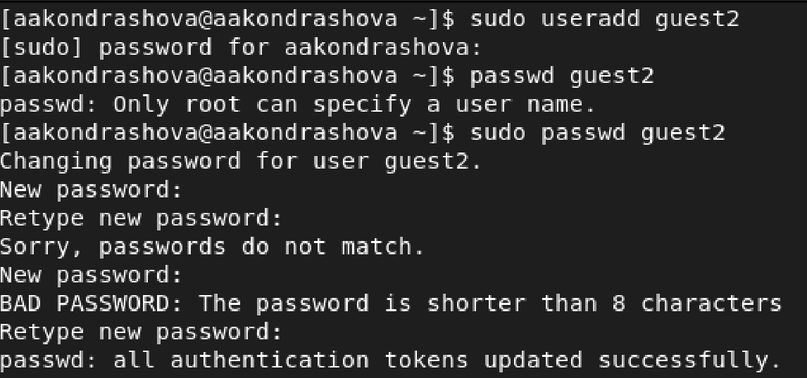{ #fig:001 width=70% }

2. Добавим нового пользователя в группу guest

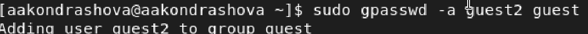{ #fig:002 width=70% }

3. Осуществим вход в систему от двух пользователей (в разных консолях) и поссмотрим директорию, в которой находимся. Для обоих пользователей это домашняя папка.

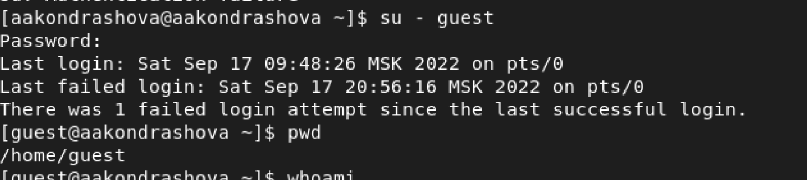{ #fig:003 width=70% }

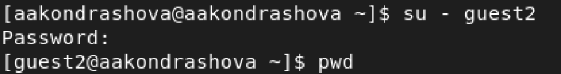{ #fig:004 width=70% }

4. Уточним для каждого пользователя информацию об имени группе, кто входит в нее и к каким группам принадлежит сам пользователь.

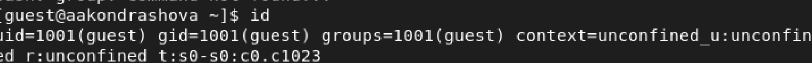{ #fig:005 width=70% }

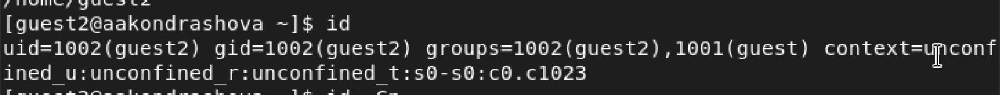{ #fig:006 width=70% }

5. Командой groups выведем информцию о том, в какие группы входят пользователи guest и guest2. Сравнивая с выводом команды id -G и id -Gn получаем, что они обе выводят информацию, о группах, в которые входит пользователь.

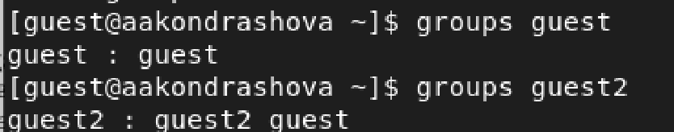{ #fig:007 width=70% }

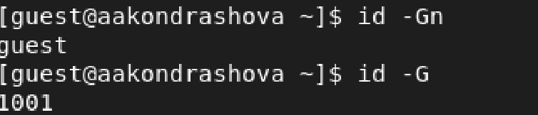{ #fig:008 width=70% }

6. Также просматриваем вывод команды cat /etc/group, которая тоже выдает нам информацию о группах всех пользователей.

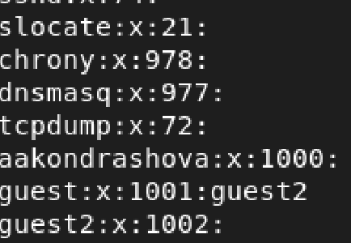{ #fig:009 width=70% }

7. От имени пользователя guest2 выполним регистрацию этого пользователя в группе guest.

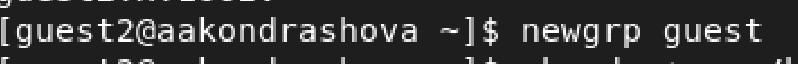{ #fig:010 width=70% }

8. От пользователя guest изменяем права директории и снимем все атрибуты.

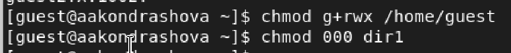{ #fig:011 width=70% }

9. Заполним таблицу "Установленные права и разрешенные действия для групп"

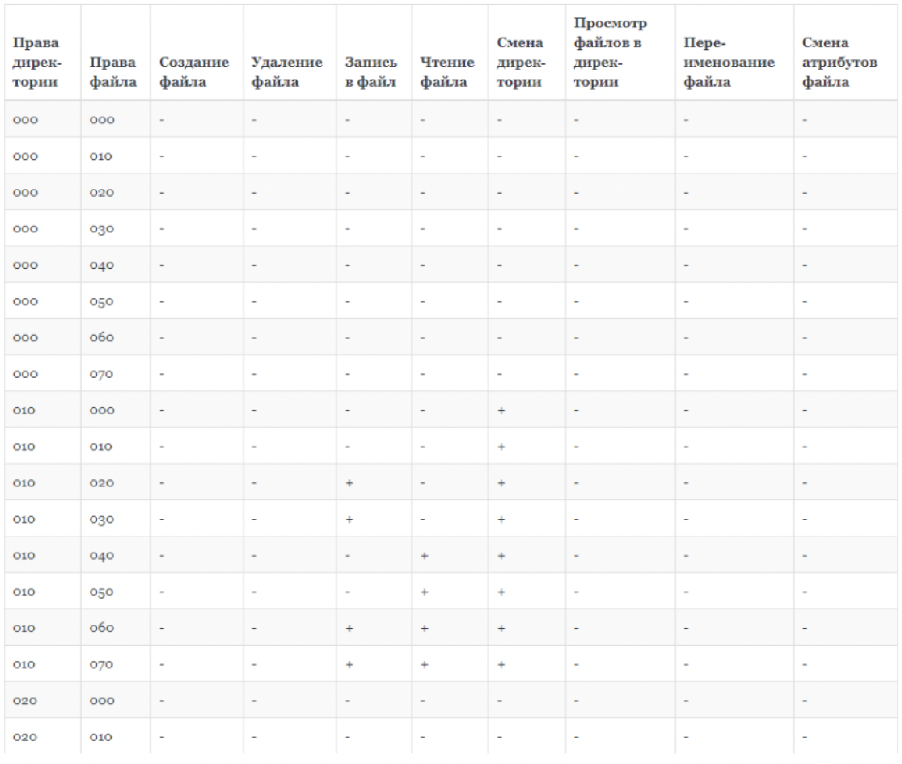{ #fig:012 width=70% }

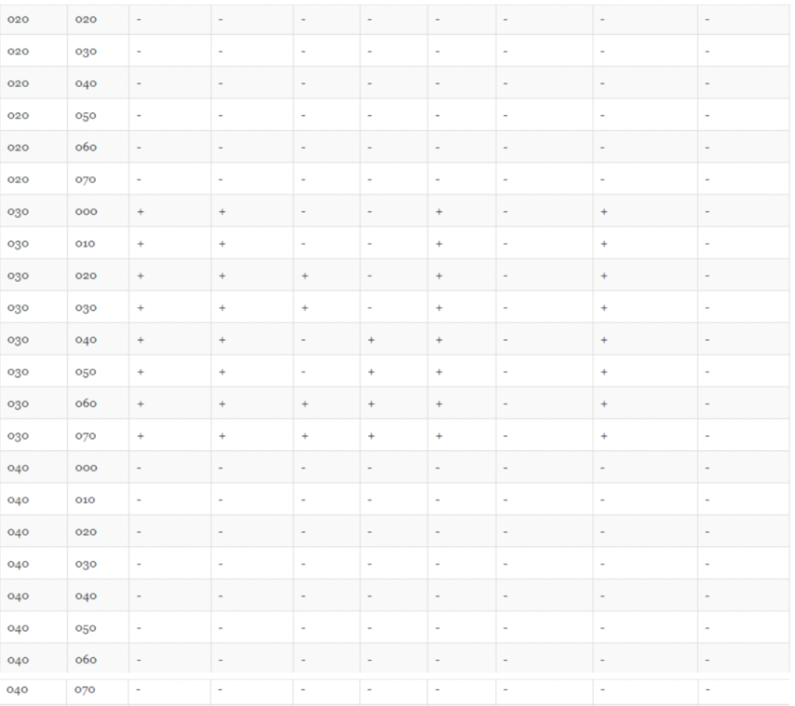{ #fig:013 width=70% }

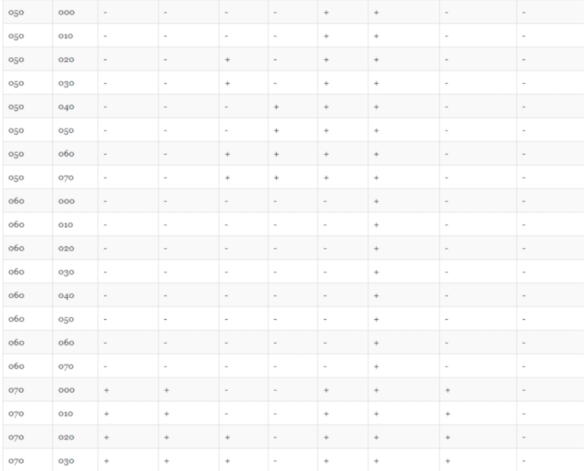{ #fig:014 width=70% }

10. Заполним таблицу "Минимальные права для совершения операций от имени пользователей, входящих в группу"

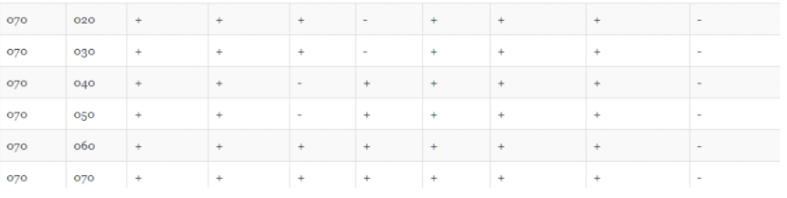{ #fig:015 width=70% }

# Выводы

Мною получены практические навыки работы в консоли с атрибутами файлов для групп пользователей.

