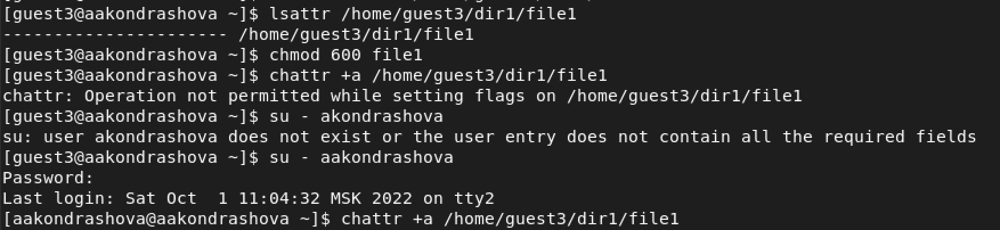
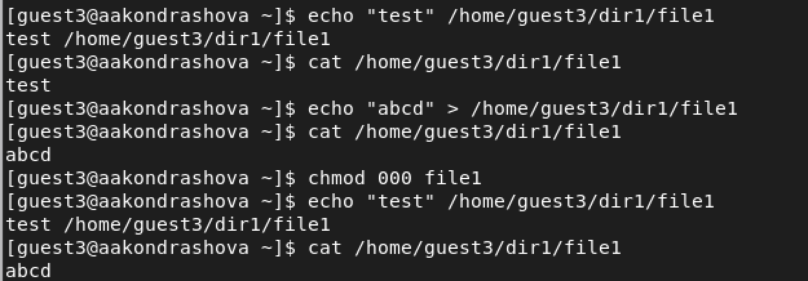
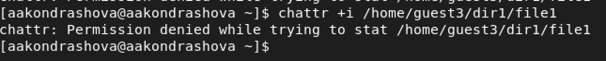
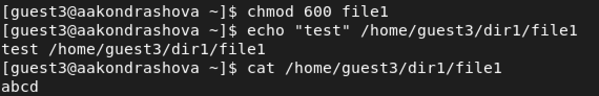

---
## Front matter
lang: ru-RU
title: Лабораторная работа №4
subtitle: Основы информационной безопасности
author:
  - Кондрашова А. А.
institute:
  - Российский университет дружбы народов, Москва, Россия
  - НПМбд-01-19
date: 1 октября 2022

## i18n babel
babel-lang: russian
babel-otherlangs: english

## Formatting pdf
toc: false
toc-title: Содержание
slide_level: 2
aspectratio: 169
section-titles: true
theme: metropolis
header-includes:
 - \metroset{progressbar=frametitle,sectionpage=progressbar,numbering=fraction}
 - '\makeatletter'
 - '\beamer@ignorenonframefalse'
 - '\makeatother'
---

## Цели и задачи

- Получение практических навыков работы в консоли с расширенными атрибутами файлов.

## Выполнение лабораторной работы

- От имени пользователя guest3 определяю расширенные атрибуты файла, затем устанавливаю на файл права, разрешающие чтение и запись для владельца файла. Пытаемся установить расширенный атрибут а, но нам это не удается, тогда мы делаем это от имени администратора.

{ #fig:001 width=70% }

## Выполнение лабораторной работы

- Выполняем дозапись в файл и убеждаемся, что оно запсалось. Затем перезаписываем файл и тоже проверяем результат. Ставим на файл права, запрещающие чтение и запись владельцу файла. Проделываем теже самые операции и получаем отказ. Убираем расширенные права а.

{ #fig:002 width=70% }

## Выполнение лабораторной работы

- Заменяем атрибут а атрибутом i.

{ #fig:003 width=70% }

## Выполнение лабораторной работы

- Проделываем теже самые действия.В данном случае файл можно было только прочитать, а изменить или записать в него что-то нельзя.

{ #fig:004 width=70% }

## Выводы

- Мы повысили свои навыки использования интерфейса командной строки, познакомились на примерах с тем, как используются основные и расширенные атрибуты при разграничении доступа.

