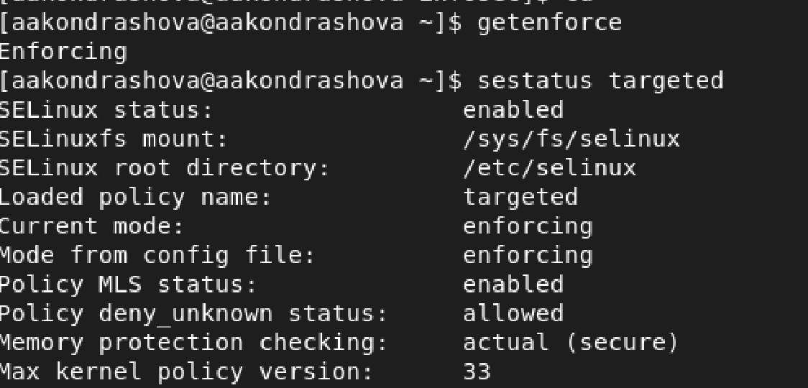
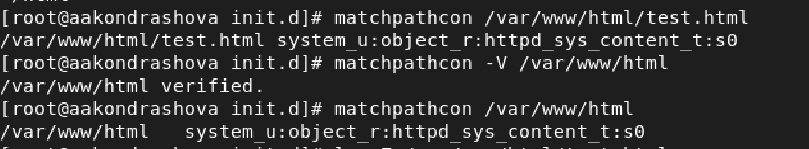

---
## Front matter
lang: ru-RU
title: Лабораторная работа №6
subtitle: Основы информационной безопасности
author:
  - Кондрашова А. А.
institute:
  - Российский университет дружбы народов, Москва, Россия
  - НПМбл-01-19
date: 15 октября 2022 г.

## i18n babel
babel-lang: russian
babel-otherlangs: english

## Formatting pdf
toc: false
toc-title: Содержание
slide_level: 2
aspectratio: 169
section-titles: true
theme: metropolis
header-includes:
 - \metroset{progressbar=frametitle,sectionpage=progressbar,numbering=fraction}
 - '\makeatletter'
 - '\beamer@ignorenonframefalse'
 - '\makeatother'
---

## Цели и задачи

- Развить навыки администрирования ОС Linux. Получить первое практическое знакомство с технологией SELinux1
- Проверить работу SELinx на практике совместно с веб-сервером Apache.

## Выполнение лабораторной работы 

- С помощью команды getenforce убеждаемся, что SELinux работает в режиме enforcing, а с помощью комнды sestatus устанавливаем политику targeted

{ #fig:001 width=70% }

## Выполнение лабораторной работы 

 - Убеждаемся, что сервер работает с помощью команды service httpd status

{ #fig:002 width=70% }

## Выполнение лабораторной работы 

- С помощью команды ps -eZ находим, что контекст безопасности Apache - httpd_t

{ #fig:003 width=70% }

## Выполнение лабораторной работы 

- Смотрим текущее состояние переключателей командой sestatus -b httpd

{ #fig:004 width=70% }

## Выполнение лабораторной работы 

- Смотрим статистику по политике командой seinfo. Узнаём, что множество пользователей --- 8, ролей --- 14, типов --- 5002

{ #fig:005 width=35% }

## Выполнение лабораторной работы 

- Определяем тип файлов и круг пользователей с правой на создание и поддиректорий в директориях /var/www и /var/www/html командой ls -lZ

{ #fig:006 width=70% }

## Выполнение лабораторной работы 

 - От имени суперпользователя создаём файл /var/www/html/test.html

{ #fig:007 width=70% }

## Выполнение лабораторной работы 

- Командой matchpathcon узнаём контекст файла test.html и директории /var/www/html --- это httpd_sys_content_t.

{ #fig:008 width=70% }

## Выполнение лабораторной работы 

- Изучая справку man httpd_selunix узнаём, что для httpd определены следующие контексты: httpd_sys_content_t, httpd_sys_script_exec_t, httpd_sys_script_ro_t, httpd_sys_script_rw_t, httpd_sys_script_ra_t, httpd_unconfined_script_exec_t. Меняем контекст файла test.html командой chcon -t.

{ #fig:010 width=70% }

## Выполнение лабораторной работы 

- При повторной попытке открыть файл через веб-браузер получаем ошибку доступа.

{ #fig:011 width=70% }

## Выполнение лабораторной работы 

- Убеждаемся, что файл доступен для чтения всем пользователям командой ls -l. Далее смотрим log-файлы веб-сервера Apache командой tail, где показаны ошибки.

{ #fig:012 width=25% }

## Выполнение лабораторной работы

- Устанавливаем веб-сервер Apache на прослушивание TCP-порта 81, изменяя строку Listen в файле /etc/httpd/conf/httpd.conf.

{ #fig:013 width=70% }

## Выполнение лабораторной работы 

- Перезапускаем сервер и смотри данные log-файлов веб-сервера Apache.

{ #fig:014 width=70% }

## Выполнение лабораторной работы 

Устанавлием для веб-сервера Apache порт TCP-81 и проверяем его наличие в списке портов командой semanage.

{ #fig:015 width=70% }

## Выполнение лабораторной работы 

- Возвращаем файлу test.html контекст httpd_sys_content_t и снова успешно просматриваем страницу в веб-браузере.

{ #fig:016 width=70% }

## Выполнение лабораторной работы 

- Возвращаем в конфигурационный файл прослушивание порта 80 и удаляем порт 81 из списка портов.

{ #fig:017 width=70% }

## Выполнение лабораторной работы 

- Удаляем файл test.html.

{ #fig:018 width=70% }

## Выводы

 Я получила основные навыки администрирования в OC Linux и проверила работу SELinux на практике совместно с веб-сервером Apache.
