---
## Front matter
title: "Лабораторная работа №6"
subtitle: "Основы информационной безопасности"
author: "Кондрашова Анастасия Андреевна"

## Generic otions
lang: ru-RU
toc-title: "Содержание"

## Bibliography
bibliography: bib/cite.bib
csl: pandoc/csl/gost-r-7-0-5-2008-numeric.csl

## Pdf output format
toc: true # Table of contents
toc-depth: 2
lof: true # List of figures
lot: true # List of tables
fontsize: 12pt
linestretch: 1.5
papersize: a4
documentclass: scrreprt
## I18n polyglossia
polyglossia-lang:
  name: russian
  options:
	- spelling=modern
	- babelshorthands=true
polyglossia-otherlangs:
  name: english
## I18n babel
babel-lang: russian
babel-otherlangs: english
## Fonts
mainfont: PT Serif
romanfont: PT Serif
sansfont: PT Sans
monofont: PT Mono
mainfontoptions: Ligatures=TeX
romanfontoptions: Ligatures=TeX
sansfontoptions: Ligatures=TeX,Scale=MatchLowercase
monofontoptions: Scale=MatchLowercase,Scale=0.9
## Biblatex
biblatex: true
biblio-style: "gost-numeric"
biblatexoptions:
  - parentracker=true
  - backend=biber
  - hyperref=auto
  - language=auto
  - autolang=other*
  - citestyle=gost-numeric
## Pandoc-crossref LaTeX customization
figureTitle: "Рис."
tableTitle: "Таблица"
listingTitle: "Листинг"
lofTitle: "Список иллюстраций"
lotTitle: "Список таблиц"
lolTitle: "Листинги"
## Misc options
indent: true
header-includes:
  - \usepackage{indentfirst}
  - \usepackage{float} # keep figures where there are in the text
  - \floatplacement{figure}{H} # keep figures where there are in the text
---

# Цель работы

- Развить навыки администрирования ОС Linux. Получить первое практическое знакомство с технологией SELinux1
- Проверить работу SELinx на практике совместно с веб-сервером
Apache.

# Выполнение лабораторной работы

1. С помощью команды getenforce убеждаемся, что SELinux работает в режиме enforcing, а с помощью комнды sestatus устанавливаем политику targeted

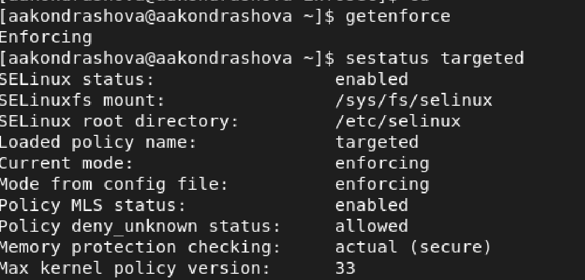{ #fig:001 width=70% }

2. Убеждаемся, что сервер работает с помощью команды service httpd status

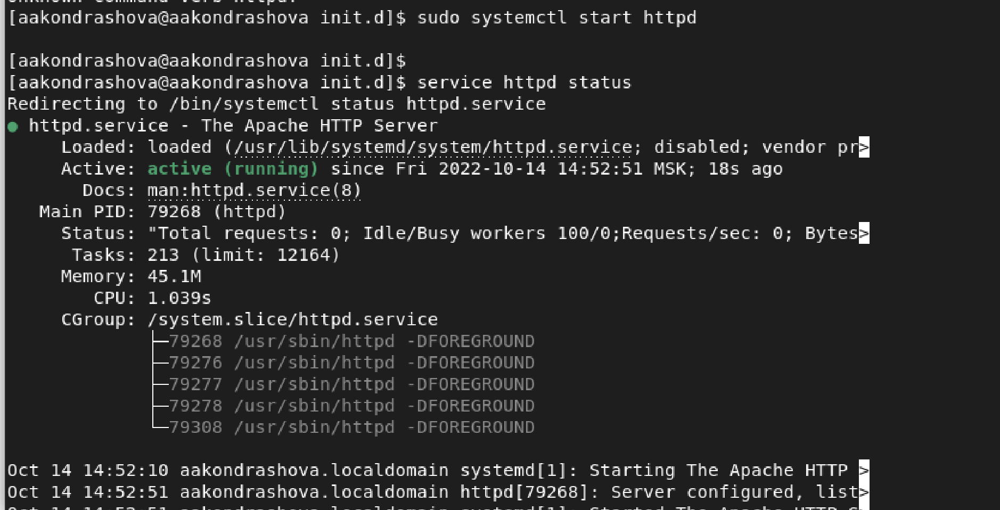{ #fig:002 width=70% }

3. С помощью команды ps -eZ находим, что контекст безопасности Apache - httpd_t

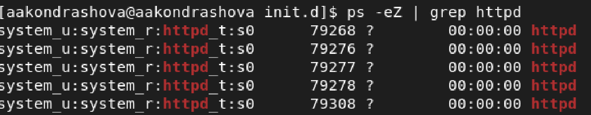{ #fig:003 width=70% }

4. Смотрим текущее состояние переключателей командой sestatus -b httpd

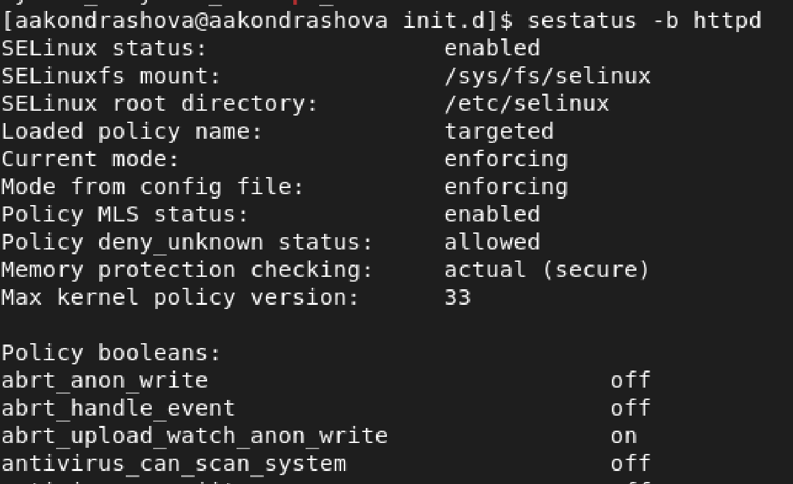{ #fig:004 width=70% }

5. Смотрим статистику по политике командой seinfo. Узнаём, что множество пользователей --- 8, ролей --- 14, типов --- 5002

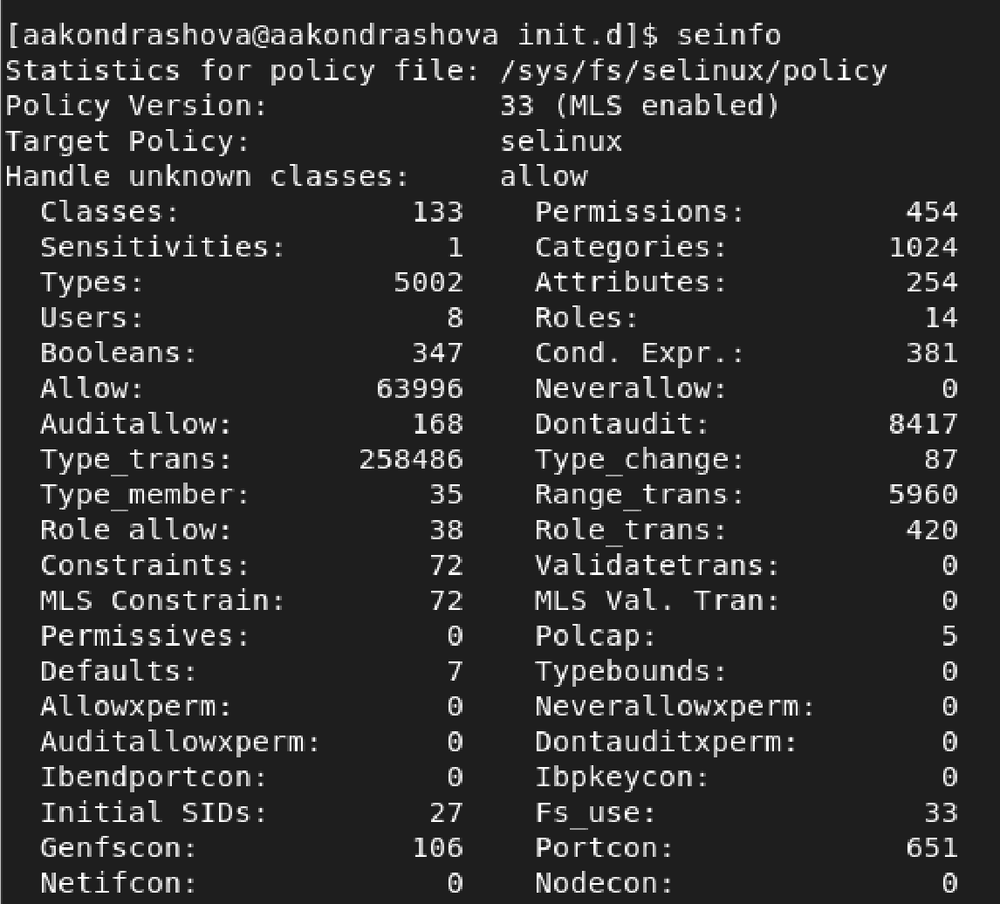{ #fig:005 width=70% }

6. Определяем тип файлов и круг пользователей с правой на создание и поддиректорий в директориях /var/www и /var/www/html командой ls -lZ

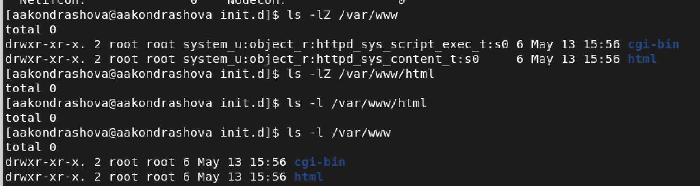{ #fig:006 width=70% }

7. От имени суперпользователя создаём файл /var/www/html/test.html

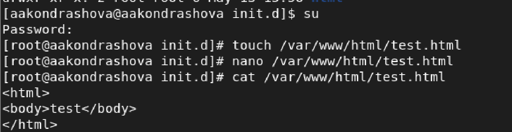{ #fig:007 width=70% }

8. Командой matchpathcon узнаём контекст файла test.html и директории /var/www/html --- это httpd_sys_content_t.

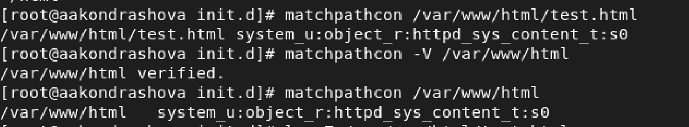{ #fig:008 width=70% }

9. Обращаемся к файлу через ссылку в веб-браузере. Контент отображён корректно.

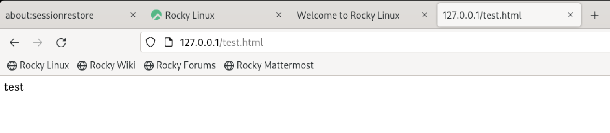{ #fig:009 width=70% }

10. Изучая справку man httpd_selunix узнаём, что для httpd определены следующие контексты: httpd_sys_content_t, httpd_sys_script_exec_t, httpd_sys_script_ro_t, httpd_sys_script_rw_t, httpd_sys_script_ra_t, httpd_unconfined_script_exec_t. Меняем контекст файла test.html командой chcon -t.

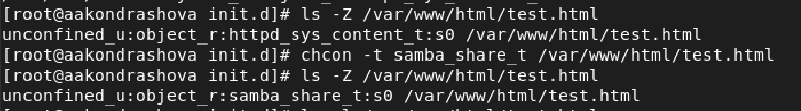{ #fig:010 width=70% }

11. При повторной попытке открыть файл через веб-браузер получаем ошибку доступа.

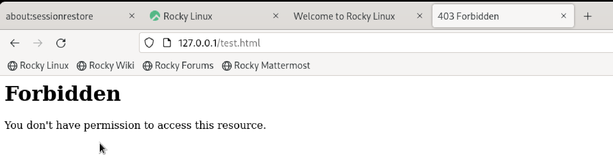{ #fig:011 width=70% }

12. Убеждаемся, что файл доступен для чтения всем пользователям командой ls -l. Далее смотрим log-файлы веб-сервера Apache командой tail, где показаны ошибки.

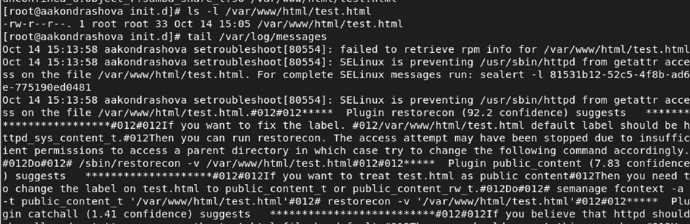{ #fig:012 width=70% }

13. Устанавливаем веб-сервер Apache на прослушивание TCP-порта 81, изменяя строку Listen в файле /etc/httpd/conf/httpd.conf.

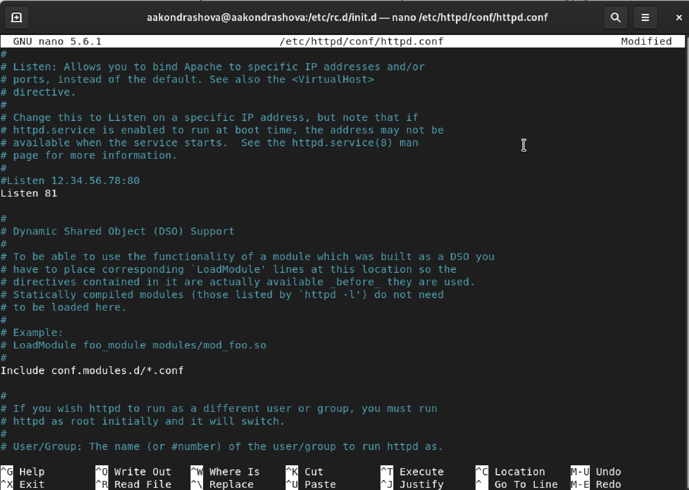{ #fig:013 width=70% }

14. Перезапускаем сервер и смотри данные log-файлов веб-сервера Apache.

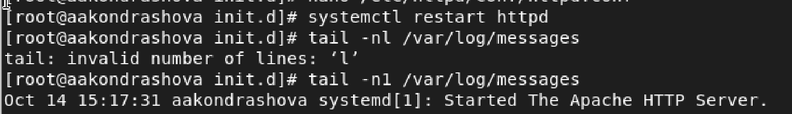{ #fig:014 width=70% }

15. Устанавлием для веб-сервера Apache порт TCP-81 и проверяем его наличие в списке портов командой semanage.

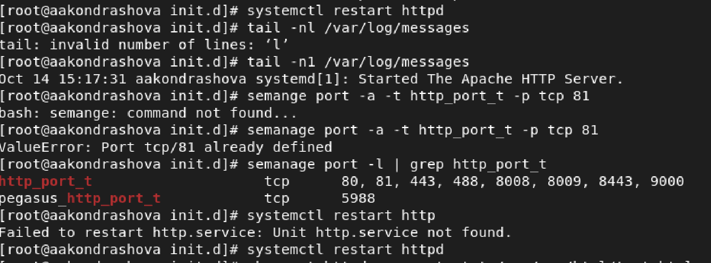{ #fig:015 width=70% }

16. Возвращаем файлу test.html контекст httpd_sys_content_t и снова успешно просматриваем страницу в веб-браузере.

{ #fig:016 width=70% }

17. Возвращаем в конфигурационный файл прослушивание порта 80 и удаляем порт 81 из списка портов.

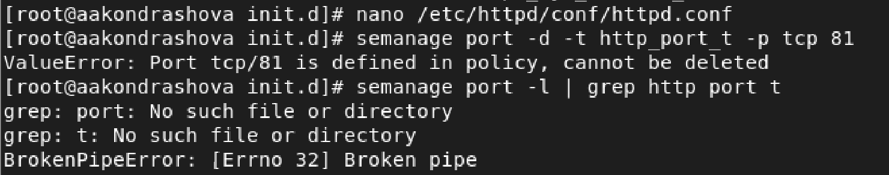{ #fig:017 width=70% }

18. Удаляем файл test.html.

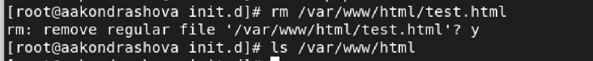{ #fig:018 width=70% }

# Выводы

Я получила основные навыки администрирования в OC Linux и проверила работу SELinux на практике совместно с веб-сервером Apache.
